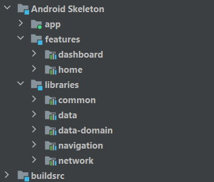

# AndroidSkeleton

An android template for creating a new project with most set up already done.

## Tech stack

- [Kotlin](https://kotlinlang.org/) - First class and official programming language for Android development.
- [Coroutines](https://kotlinlang.org/docs/reference/coroutines-overview.html) and [Flow](https://kotlinlang.org/docs/reference/coroutines/flow.html#asynchronous-flow) - Official Kotlin's tooling for performing asynchronous work.
- [MVVM Architecture](https://developer.android.com/jetpack/guide) - Official recommended architecture for building robust, production-quality apps.
- [Android Jetpack](https://developer.android.com/jetpack) - A suite of libraries to help developers build state-of-the-art applications.
  - [Navigation](https://developer.android.com/guide/navigation) - Navigation is a framework for navigating between screens within an Android application.
  - [ViewModel](https://developer.android.com/topic/libraries/architecture/viewmodel) - The ViewModel is designed to store and manage UI-related data in a lifecycle conscious way.
  - [Room](https://developer.android.com/topic/libraries/architecture/room) - The Room library provides an abstraction layer over SQLite to allow for more robust database access.
  - [Dagger Hilt](https://developer.android.com/training/dependency-injection/hilt-android) - Hilt is a dependency injection library for Android.
  - [Compose](https://developer.android.com/jetpack/compose?gclid=Cj0KCQjw1aOpBhCOARIsACXYv-c5wbkpE1TCI3KuMlWQarpOOYfkJEYHomaynN_-JGv5DfyK5_HLsiQaArgwEALw_wcB&gclsrc=aw.ds) - Jetpack Compose is Android’s recommended modern toolkit for building native UI. It simplifies and accelerates UI development on Android. Quickly bring your app to life with less code, powerful tools, and intuitive Kotlin APIs.
- [Retrofit](https://github.com/square/retrofit) - A library for building REST API clients.
- [Moshi](https://github.com/square/moshi) - A modern JSON library for Android and Java. It makes it easy to parse JSON into Java objects.
- [Timber](https://github.com/JakeWharton/timber) - A logger with a small, extensible API which provides utility on top of Android's normal Log class.
- [Gradle's Kotlin DSL](https://docs.gradle.org/current/userguide/kotlin_dsl.html) - Gradle’s Kotlin DSL is an alternative syntax to the Groovy DSL with an enhanced editing experience.
- [Version catalogs](https://developer.android.com/build/migrate-to-catalogs) - Gradle version catalogs enable you to add and maintain dependencies and plugins in a scalable way. Using Gradle version catalogs makes managing dependencies and plugins easier when you have multiple modules.

## Project structure

- app - main app module
- features - package for feature modules
- libraries - package for other modules (not feature related)
  - common - common logic between all or most modules
  - data - database, entities
  - data-domain - domain models, mappers
  - navigation - navigation handling logic
  - network - api interfaces, response models
